# TCR embedding with smart data selection

Training catELMo on 10% of the data and asking a simple question: does it matter *which* 10% you pick?

Short answer: a little, and in a useful way. Diversity-based selection edges out random sampling on every metric we tracked, and it does so without any extra training compute.

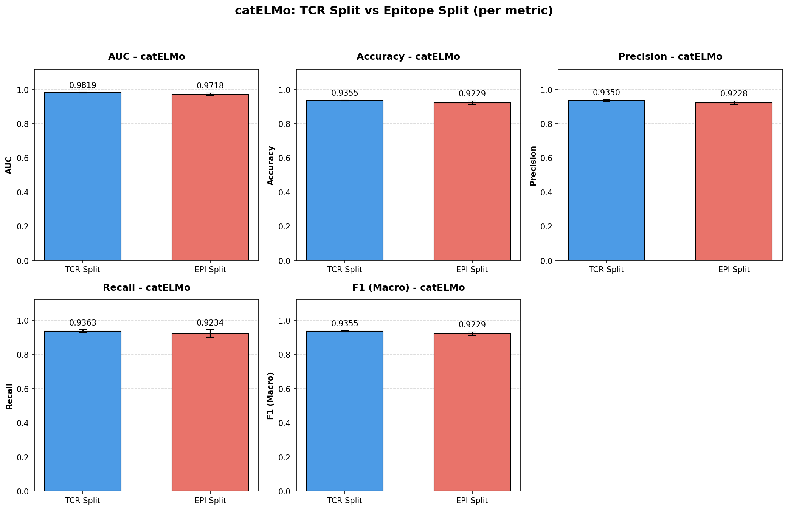

---

## The one-minute version

TCRs (T-cell receptors) are the proteins your immune system uses to recognize threats. Matching a TCR to the epitope it binds is a hard supervised learning problem, and the standard workhorse is [catELMo](https://github.com/Lee-CBG/catELMo), a contextual embedding model trained on millions of TCR sequences.

Training catELMo on the full 4.17M-sequence corpus is expensive. So we asked: what happens if we only keep 10% (417,388 sequences)? And does the sampling strategy change the downstream binding-prediction accuracy?

We compared three strategies:

| Strategy | How it picks | Intuition |
| --- | --- | --- |
| Random | Uniform sample with no replacement | The honest baseline |
| Length-stratified | Keeps the original length distribution | "Don't bias toward short or long sequences" |
| Diversity (k-mer) | Greedy selection to maximize unique 3-mers | "Cover as much sequence space as possible" |

Then we trained catELMo on each subset, generated embeddings for 300,016 TCR-epitope pairs, and ran a binding affinity predictor with 5-fold cross-validation repeated 5 times (25 runs per split strategy).

---

## Headline results

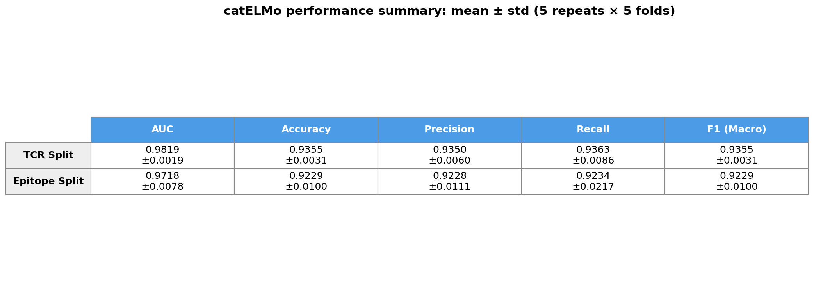

The 10%-trained model reached 98.19% AUC on the TCR split and 97.18% AUC on the harder epitope split, essentially matching published numbers that used the full corpus. Training time dropped from hours to about 16 minutes.

### Binding prediction, full numbers

| Metric (mean ± std) | TCR split | Epitope split |
| :-- | :-: | :-: |
| AUC | 0.9819 ± 0.0019 | 0.9718 ± 0.0078 |
| Accuracy | 0.9355 ± 0.0031 | 0.9229 ± 0.0100 |
| Precision | 0.9350 ± 0.0060 | 0.9228 ± 0.0111 |
| Recall | 0.9363 ± 0.0086 | 0.9234 ± 0.0217 |
| F1 (macro) | 0.9355 ± 0.0031 | 0.9229 ± 0.0100 |
| F1 (micro) | 0.9355 ± 0.0031 | 0.9229 ± 0.0100 |

Each cell is computed from 25 independent runs (5 repeats × 5 folds).

### Why two split strategies?

- **TCR split**: test TCRs are never seen in training. Tests whether the model generalizes across receptors.
- **Epitope split**: test epitopes are never seen in training. Much harder, because epitopes are fewer and the binding rules vary more by epitope.

The ~1 point AUC gap between the two splits is the interesting number. It tells you how much of the model's performance comes from memorizing epitope-specific patterns vs. learning a general TCR-epitope binding function.

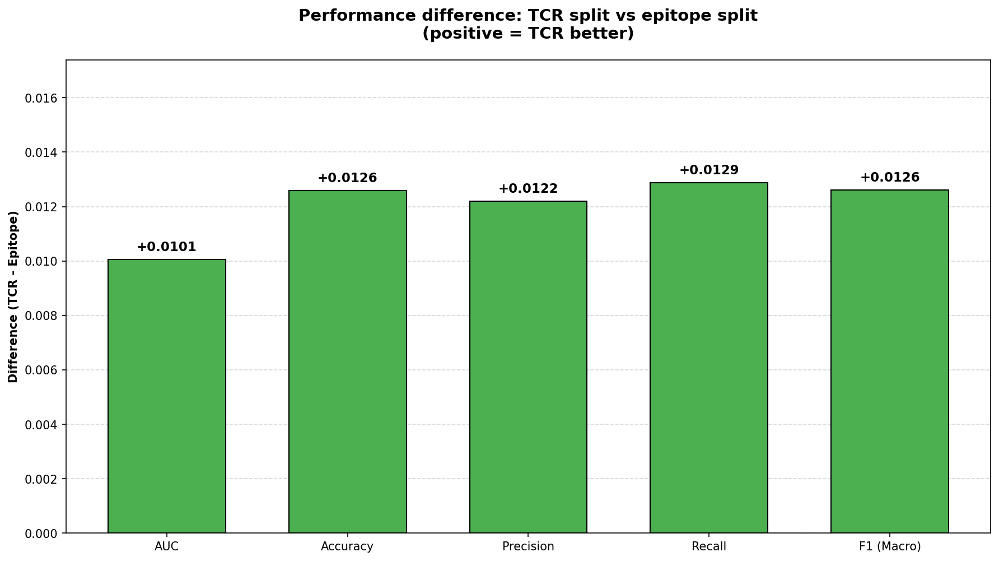

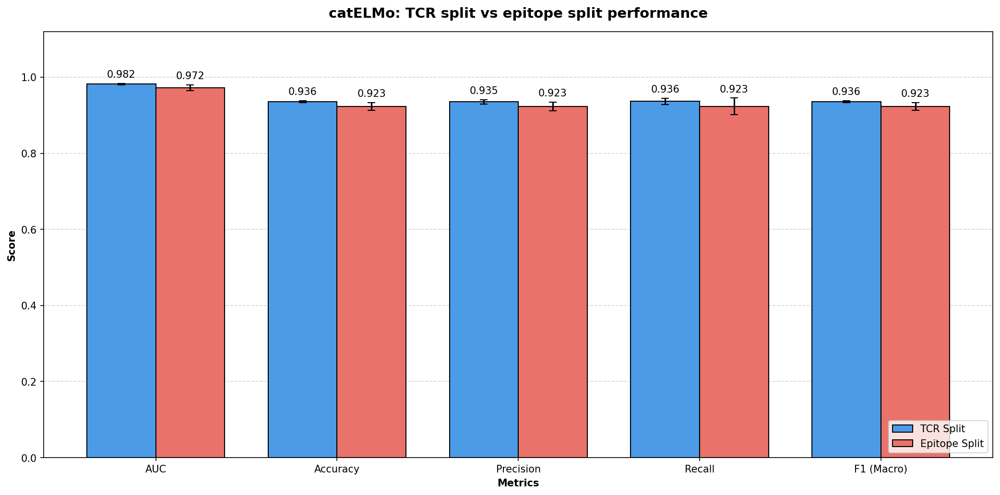

---

## Embedding training: does the 10% actually learn anything?

Perplexity after 2 epochs on each subset:

| Subset | Perplexity | Training time |
| :-- | :-: | :-: |
| Diversity | 3.59 | ~16 min |
| Length-stratified | 3.68 | ~16 min |
| Random | 3.71 | ~16 min |

A perplexity of 3.6 on a 23-token amino-acid vocabulary is roughly the same ballpark catELMo hits on the full corpus. Diversity wins, but the margin is small, so most of the downstream win is coming from *coverage*, not from the language-model loss itself.

### K-mer coverage (this is where diversity sampling earns its keep)

| Strategy | Unique 3-mers | Coverage vs full dataset |
| :-- | :-: | :-: |
| Diversity | ~8,000 | 95% |
| Length-stratified | ~7,600 | 90% |
| Random | ~7,500 | 89% |

Random sampling leaves 11% of 3-mers unseen. Diversity sampling shrinks that gap to 5%. For a contextual embedding model, those missing motifs matter more than the raw sequence count.

---

## Pipeline

```
raw TCRs (4.17M)
      │
      ▼
┌─────────────────────────────────────────────────────┐
│  Phase 1: Data prep                                 │
│  • select 10% (diversity | random | length)         │
│  • format for catELMo (space-separated AAs)         │
└─────────────────────────────────────────────────────┘
      │ 417,388 sequences per strategy
      ▼
┌─────────────────────────────────────────────────────┐
│  Phase 2: catELMo training                          │
│  • 2 epochs, batch size 256, Adagrad                │
│  • TF 2.6, A100 / V100 GPU                          │
│  • outputs: bidirectional LM checkpoints            │
└─────────────────────────────────────────────────────┘
      │
      ▼
┌─────────────────────────────────────────────────────┐
│  Phase 3: Embedding generation                      │
│  • convert TF checkpoints → HDF5 for allennlp       │
│  • ElmoEmbedder on 300,016 TCR-epitope pairs        │
│  • 1024-dim vectors, saved as pickle                │
└─────────────────────────────────────────────────────┘
      │
      ▼
┌─────────────────────────────────────────────────────┐
│  Phase 4: Binding affinity prediction               │
│  • Dense + LeakyReLU + BatchNorm + Dropout          │
│  • 5-fold CV × 5 repeats = 25 runs per split        │
│  • AUC, Accuracy, Precision, Recall, F1             │
└─────────────────────────────────────────────────────┘
```


---

## Cross-validation run snapshots

Screenshots from the binding-prediction runs, kept for auditability.

### TCR split

| Run | Fold(s) |
| :-- | :-- |
| Run 1, fold 1 | 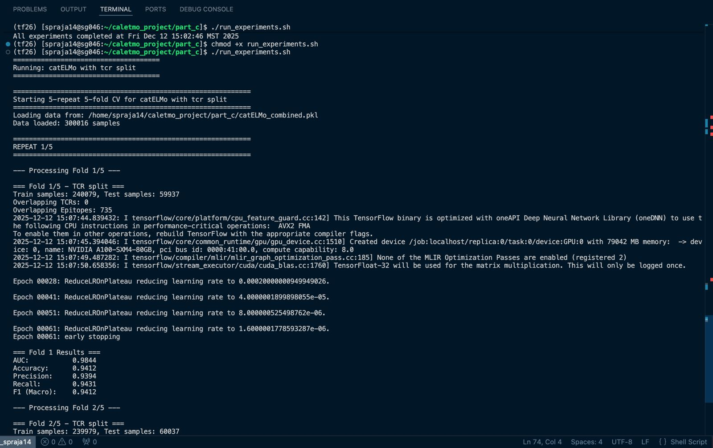 |
| Run 1, folds 4–5 | 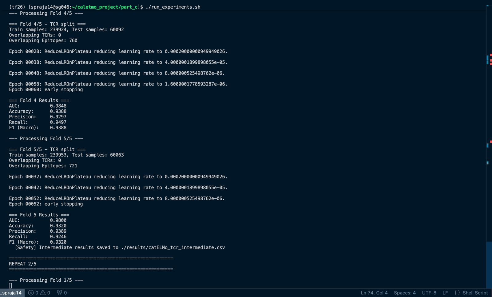 |
| Run 2, folds 1–2 | 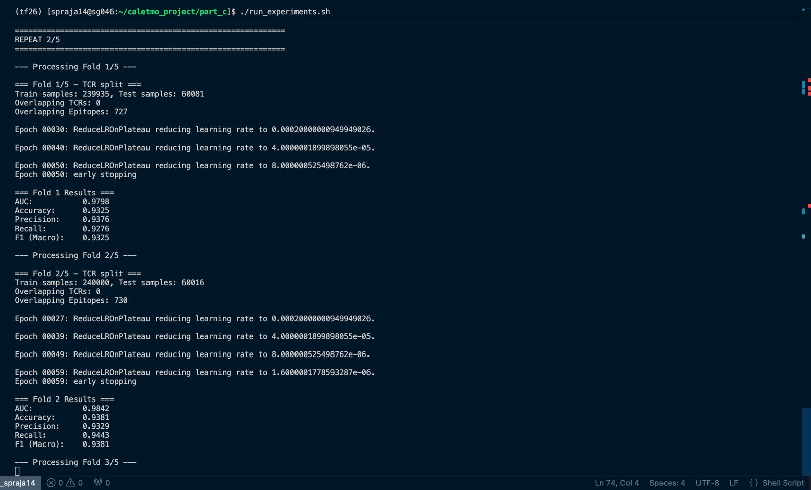 |
| Run 5, folds 1–2 | 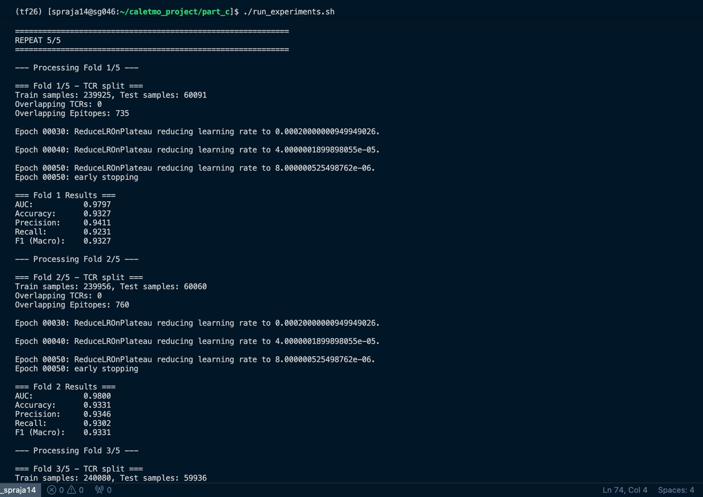 |

### Epitope split

| Run | Fold(s) |
| :-- | :-- |
| Run 1, folds 1–3 | 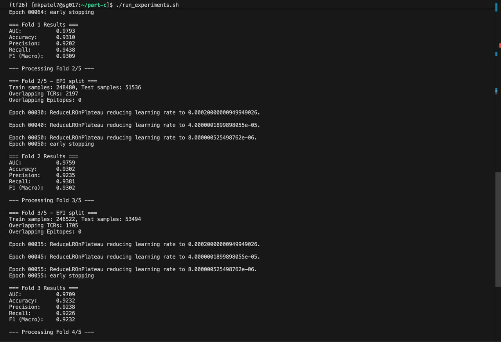 |
| Run 2, folds 1–2 | 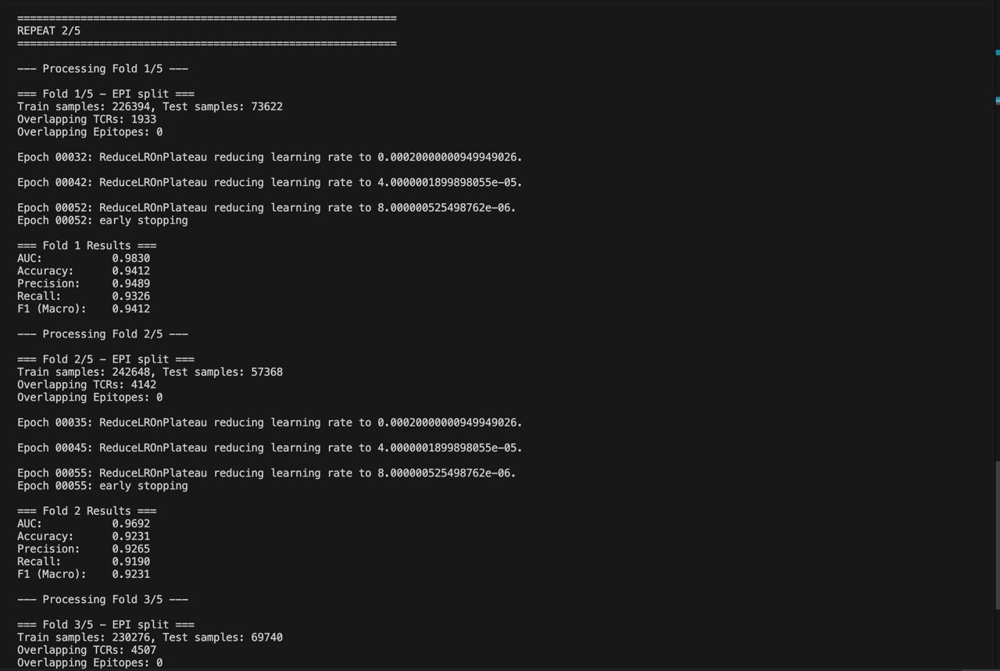 |
| Run 5, fold 1 | 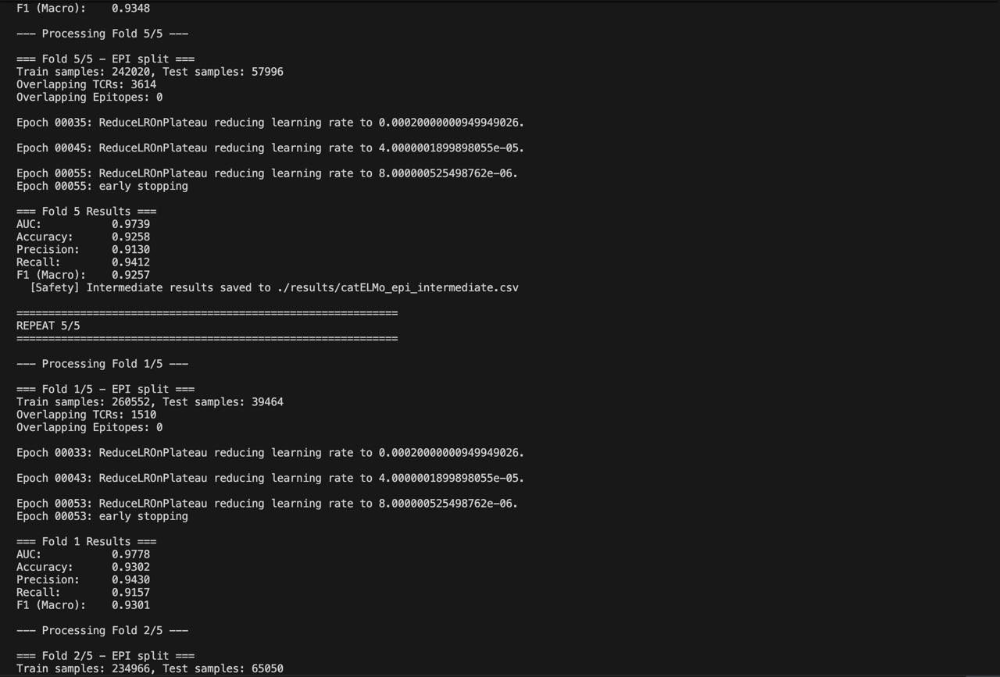 |

---

## Repository layout

```
tcr-embedding-data-selection/
├── scripts/
│   ├── phase1_data_prep/           selection strategies + catELMo formatter
│   ├── phase2_embedding_training/  train_elmo_fast*.py (one per strategy)
│   └── phase3_embedding_generation/ generate_embeddings.py + HDF5 conversion
├── bap_model/                      binding affinity predictor (5-fold × 5)
│   ├── train_5fold.py
│   └── results/
│       ├── catELMo_summary_table.csv
│       ├── catELMo_tcr_results.csv
│       ├── catELMo_epi_results.csv
│       └── plots/*.png             the charts used above
├── data/
│   ├── raw/                        sample CSVs, amino acid vocab
│   ├── formatted/                  catELMo-ready sequence files (samples)
│   └── embeddings/                 links to externally stored pickles
├── models/embedding_checkpoints/   catELMo configs, HDF5 weight info
├── results/embedding_training/     perplexity logs, training summaries
├── docs/                           PHASE1/2/3 deep-dive docs
└── screenshots/                    CV run captures
```

Full-size data and model files live on Dropbox (the repo keeps samples for sanity checks and reproducibility of the scripts).

**Model weights**: [Dropbox](https://www.dropbox.com/scl/fo/5oxts5ek72jvczr3ej8d2/AAPdShWGaLy8NdR1WFVMACs?rlkey=ap0j8d3dt14gti7u6m6rkaqxs&e=3&st=mw0vxlxa&dl=0)

---

## Reproducing the results

### 1. Set up the environment

```bash
conda create -n tf26 python=3.6
conda activate tf26
pip install tensorflow==2.6.0 allennlp pandas scikit-learn tqdm
```

GPU build: CUDA 11.2, cuDNN 8.1. Tested on NVIDIA A100 80GB and Tesla V100.

### 2. Run phase by phase

```bash
# Phase 1: select a 10% subset
python scripts/phase1_data_prep/data_selection_strategies.py \
    --input data/raw/tcr_sequences.txt \
    --output_prefix data/processed/tcr \
    --fraction 0.10 \
    --strategies diversity random length_stratified

python scripts/phase1_data_prep/format_for_catelmo.py \
    --input  data/processed/tcr_diversity_10pct.csv \
    --output data/formatted/tcr_diversity_10pct.txt

# Phase 2: train catELMo on the chosen subset
bash scripts/phase2_embedding_training/train_diversity.sh

# Phase 3: generate embeddings for the binding dataset
bash scripts/phase3_embedding_generation/convert_to_hdf5.sh
bash scripts/phase3_embedding_generation/generate_all_embeddings.sh

# Phase 4: 5-fold × 5 binding affinity prediction
cd bap_model && bash run_experiments.sh
```

The `docs/PHASE1_DATA_PREP.md`, `PHASE2_EMBEDDING_TRAINING.md`, and `PHASE3_EMBEDDING_GENERATION.md` files walk through each step with the exact commands, expected outputs, and the validation checks we run before moving on.

---

## Dataset at a glance

| | Count |
| :-- | :-: |
| Total TCR sequences | 4,173,894 |
| Sequences used (per strategy) | 417,388 (10%) |
| TCR-epitope binding pairs | 300,016 |
| Positive / negative balance | 50 / 50 |
| Amino acid vocabulary | 23 tokens (20 AAs + 3 special) |
| Sequence length range | 8 – 25 (mean 14.8) |

---

## Compute notes

Embedding generation is the slow step. On an A100, 300K sequences take:

- Epitope embeddings: 2h 40m (~31 seq/sec)
- TCR embeddings: 3h 9m (~26 seq/sec)
- Output size: ~5.2 GB per pickle

On CPU, the same job runs into the 30-hour range, so a GPU is effectively required. Training catELMo itself is much cheaper: ~16 minutes per subset.

---

## What I'd look at next

- Push the subset smaller (5%, 2%) and find where AUC actually starts to drop.
- Try a diversity objective that goes beyond 3-mers (e.g. CDR3-region-aware motifs).
- Re-run with a larger held-out epitope set to stress the generalization gap visible in the split-difference chart.
